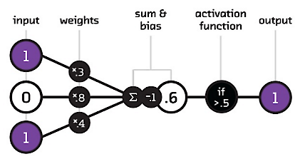

# Intro

## Social Responsibility: Wer sollte uns als Beispiel dienen?

- Peter Thiel erhielt dieses Jahr Axel Springer Award: oft als Demokratiepreis bezeichnet 
- Geht an Persönlichkeiten, die „[...] **gesellschaftliche Verantwortung übernehmen**“
  - Andere Personen, die gesellschaftliche Verantwortung übernehmen: Jeff Bezos (2018) · Elon Musk (2020) · Sam Altman (2025)

::: fragment
- Wie man gesellschaftliche Verantwortung übernimmt:

> *„If you're evil, you're at least competent. And if you're evil, you're not bad, and therefore you're actually maybe kind of good because you're at least getting something done.“*
>

:::

[@axelspringer_award; @boeselager2026; @firth2026]{.source}

::: notes
- Diese Konferenz steht ja unter dem Motto Social Responsibility, deswegen dachte ich, man könnte sich mal nach guten Beispielen umschauen
- Zum Glück gibt es einen Preis, der genau dies auszeichnet, nämlich den Axel Springer Award; Passt mit Hinsich auf zwei Aspekte: gesellschaftliche Verantwortung und Demokratie ...
- Aufsichtsratsvorsitzender von Palantir: ist auf Analyse großer Datenmengen spezialisiert und hat als Kunde viele Militär- und Sicherheitsbehörden
- Das Zitat fasst Big Tech bzw. Silicon Valley sehr gut zusammen; "move fast and break things"; Fokus auf "getting something done", aber es ist egal was und welche Konsequezen es hat 
- Diese Einstellung teilen sich viele mit Big Tech verwobenen Ideologien
-> In Wahrheit **das Gegenteil von Verantwortung übernehmen**  
:::

## Getting something done responsibly with ~~artificial~~ superintelligence

- Wie können wir KI in der Zivilgesellschaft verantwortungsvoll nutzen?
- Spannungsfeld: 
  - KI ist durch die Umstände ihrer Herstellung und Verwendung nicht nur ein Werkzeug sondern (inhärent) politisch und hat externalisierte Kosten
  - Von konkreten Problemen ausgehend kann KI als Werkzeug manchmal die beste Option sein 

[@keymolen2026]{.source}

::: notes
- In diesem Vortrag wollen wir zeigen, wie man bei der Nutzung von KI in der Zivilgesellschaft *wirklich* Verantwortung übernehmen kann: im Gegensatz zu dem, was der Axel Springer Award darunter versteht
- Wir bewegen uns dabei in einem Spannungsfeld:
  - Einerseits ist es oft am sinnvollsten, KI als Werkzeug zu betrachten: Wir gehen von einem konkreten Problem aus und fragen, ob KI die beste Lösung ist
  - Andererseits ist KI nicht *nur* ein Werkzeug: Wer sie herstellt, wie sie genutzt wird und wie sie in die Welt eingebettet ist, wirkt zurück auf die Gesellschaft und auch auf die Zivilgesellschaft
- Ablauf:
  1. Die Umstände – anknüpfend an Peter Thiels Ideologie: Wer baut KI? Welche Ziele verfolgt Big Tech? Welche Auswirkungen hat die Verbreitung von KI auf die Welt und auf die Zivilgesellschaft?
  2. Die Praxis: Für welche Probleme ist KI tatsächlich die beste Option? 
:::

# Wer entwickelt KI?

## Peter Thiel, der Antichrist und der "Grey Tribe"

- Thiel (Palantir) vertritt eine politische Theologie mit dem Antichristen als zentraler Figur
  - verspricht Frieden, Sicherheit und Einheit, z.B. durch **Multilateralismus, internationale Regulierung, interreligiösen Dialog**
  - will aber in Wahrheit Weltherrschaft  erlangen und Fortschritt aufhalten

::: fragment
- **Red Tribe** (konservativ) · **Blue Tribe** (progressiv) · **Grey Tribe** (Tech, **Akzelerationismus**)
  - Blue = Regulierung, Institutionen = Thiels „Antichrist“
  - Wie kann man Blue bekämpfen? **Balaji Srinivasan**: Grey sollte sich mit Red gegen Blue verbünden
:::

[@alexander2014; @duran2024; @andreessen2023; @brian2026; @thiel2026]{.source}

::: notes
- Exkurs in die Theologie, wir beschäfigen uns noch einmal kurz mit Thiel, der ein besonderns absurdes Beispiel für Ideologien im Tech-Bereich parat hat
- Anknüpfend an Thiels Zitat vom „getting something done“ als Selbstzweck → dahinter steckt eine relativ ausformulierte Ideologie
- Alles, was Fortschritt bzw. „getting something done“ behindert, ist der Antichrist → klare Kandidaten: …
- Tech Ideologen wie Balaji Srinivasan teilen die US-Gesellschaft in Stämme ein: Red Tribe (konservativ, ländlich, religiös), Blue Tribe (progressiv, urban, akademisch) und den Grey Tribe: das Tech-Milieu
- Dieser Ideologie folgend ist im Grey Tribe der sog. Akzelerationismus bzw. „effective accelerationism“ (e/acc) eine wichtige Ideologie: technologischen Fortschritt maximal beschleunigen, jede Bremse ist schädlich
- Hier schließt sich der Kreis zu Thiel: Was Thiel als Antichrist beschreibt – Regulierung, internationale Institutionen, Einheit –, ist genau das Programm des Blue Tribe
- Balaji Srinivasan hat den Grey Tribe zum politischen Projekt gemacht und sagt offen: Grey soll sich mit Red verbünden, gegen Blue. In San Francisco schlägt er Zonen vor, in denen Reds willkommen sind und Blues nicht
- Das alles wäre einfach nur kurious und absurd, wenn es nur Ideen wären, das Problem ist, dass auf ihrer Grundlage investiert und Politik gemacht wird
- Kommen wir nun vom Antichristen zum Anti-Antichristen
:::

## Nicht das letzte Abendmahl

::: {.img-grid style="display:flex; flex-direction:column; align-items:center; gap:8px;"}
{style="height:270px; margin:0;"}

::: {style="display:flex; justify-content:center; gap:8px;"}
{style="height:265px; margin:0;"}

{style="height:265px; margin:0;"}
:::
:::

[Oben: [@rozen2026] · Unten links: [@trump2026] · Unten rechts: [@leonardo1498]]{.source}

::: notes
- Ich verspreche das ist die letzte theologische Slide
- Auf diesem Bild sehen wir fast den kompletten Grey Tribe (Palantir, OpenAI, Microsoft, Google, Meta, Elon Musk etc.) mit dem Anführer des Red Tribes, der sich, cool und normal, btw. passend zum Thema mal als Jesus dargestellt hat.
- 2024, als Trump wiedergewählt wurde, ist das Grey/Red-Bündnis Realität geworden: Thiel und co auf der Seite von Trump, Thiels Zögling JD Vance als Vizepräsident -> Silicon Valley supported recht geschlossen Trump
- Das Bild ist auf einer Veranstaltung entstanden, bei der entschieden wurde, dass in Regierungsdokumenten anstatt Artificial Intelligence der Begriff Superintelligence verwendet werden soll. Dadurch wird in typischer Trump-Selbstentlarvungsmanier auch die Marketing-Dimension und nicht-Neutralität der Bezeichnung Künstliche-Intelligenz deutlich [@tnnd2026]
:::

# Entzauberung: Was ist KI eigentlich?

## KI Begriff: Intelligenz

> Intelligence is the computational part of the ability to achieve goals in the world. [...] Intelligence involves mechanisms, and **AI research has discovered how to make computers carry out some of them and not others**. Such programs should be considered "somewhat intelligent". [@mccarthy_what_2012]

- Intelligenz als auf ein Ziel gerichtete Fähigkeit, die unterschiedliche Komponenten umfasst (z.B. von Logik bis Erkennen von Objekten)

::: notes
- Was ist ein nüchterneres Verständnis von KI? 
- Intelligenz ist nicht Selbstbewusstsein oder der gesamte menschliche Geist
:::

## KI als Oberbegriff

::: notes

- Diese Komponenten von Intelligenz können verschiedene Technologien abdecken, wenn eine Technologie das tut, ist sie KI
  -  Das ist icht nur generative KI und Large Language Models (ChatGPT, Claude)
- Hier deswegen ein Schaubild dazu, was alles KI ist. Außerdem kommt ja der Begriff Machine Learning im Titel vor. Um zu verstehen, wie man dagegen Ragen kann, muss man zunächst verstehen was Machine Learning ist
- Die Bandbreite dessen, was alles KI ist, löst ein wenig die Spannung zwischen KI als Werkzeug und KI als politisches Artefakt auf: unterschiedliche Level an Auswirkungen bei KI-Technologien -> nicht nur generative KI kann Funktionen ausführen, die man mit Intelligenz verbindet
:::

## Neuronale Netzwerke 

- Modell biologischer Neuronen (basierend auf dem, was damals über Neuronen bekannt war) [@mcculloch_logical_1943]
- Neuronale Netzwerke erzielen beste Performance bei vielen Tasks, bzw. ermöglichen erst manche Tasks [@lecun2015]

{fig-align="center"}

# Externe Kosten

## Warum muss KI überhaupt reguliert werden?

- Neuronale Netzwerke 
  - brauchen viele Trainingsdaten und Rechenkapazitäten
  - Output nicht erklärbar

:::: {.columns}

::: {.column width="50%"}
**Ökologisch**

- **Strom & CO₂:** 2030 mehr als ganz Japan
- **Wasser:** 2025 so viel wie alles Flaschenwasser weltweit
:::

::: {.column width="50%"}
**Gesellschaftlich**

- Machtkonzentration
- Diskriminierung
- Ausbeutung (Klickarbeit)
- Cognitive Outsourcing
:::

::::

[@iea2025; @iea2026; @devries2025; @kak2023; @buolamwini2018; @williams2022; @perrigo2023; @jose2025]{.source}

::: notes
- Das folgende gilt besonders aber nicht nur auf Technolgien die auf neuronalen Netzwerken basieren
- Ökologisch:
  - Strom & CO₂: Laut IEA verbrauchen Rechenzentren bis 2030 mehr als ganz Japan heute.  Ein großer Teil davon kommt weiterhin aus fossilen Quellen.
  - Wasser: KI-Systeme verbrauchten 2025 geschätzt so viel wie der weltweite Flaschenwasserkonsum. v.a. für Kühlung, dazu kommt der indirekte Verbrauch über die Stromerzeugung. 

- Gesellschaftlich:
  - Machtkonzentration: Wenige Konzerne kontrollieren Rechenleistung, Daten und Modelle. Wer die Infrastruktur kontrolliert, setzt faktisch die Regeln, nicht demokratische Institutionen
  - Diskriminierung: Machine Learning reproduziert gesellschaftliche Ungleichheiten, Systeme entscheiden über Leben von Menschen. 
  - Ausbeutung: Hinter KI steckt viel menschliche, schlecht bezahlte Arbeit beim Datenlabeling
  - Cognitive Outsourcing: Kognitives Auslagern an KI kann kognitie Fähigkeiten wie kritisches Denken schwächen. KI unterstützt sondern ersetzt Denkprozesse zunehmend
- 
:::

## Auswirkungen von KI auf die Zivilgesellschaft

- KI-Zusammenfassungen und Chatbots 
  - Website-Traffic verringert sich drastisch
  - Weniger Kontrolle darüber, wie Informationen Menschen erreicht

::: fragment
- Einfluss auf soziale Beratungsangebote: 
  - Chatbots vermehrt für Beratung genutzt
  - Beratende von Chatbot-Sessions beeinflusst
  - KI-Psychose 
:::

::: fragment
- Ökonomische Zwänge (KI für mehr Effizienz)
- KI-Projekte haben Prestige und bekommen mehr Geld
- Work Slop 
:::

[@pew2025; @augustin2025; @niederhoffer2025]{.source}

::: notes
- Klicks auf Suchergebnisse in 8 % der Besuche mit KI-Zusammenfassung vs. 15 % ohne; nur 1 % klickt auf eine zitierte Quelle
:::

# KI als Werkzeug wofür? 

## KI Tasks 

- KI-Methoden werden für Tasks entwickelt und mit für diese gemachten Daten und Metriken evaluiert und verglichen
- Beispiele Tasks: Klassifikation, Textzusammenfassung, Nutzung von Tools
- Einfachste Metrik: Accuracy (Anteil richtiger Klassifikationen)

::: notes
- wir haben schon gesehen, dass man KI  als eine Reihe von auf ein Ziel gerichteter Fähigkeiten verstehen kann, die externalisierte Kosten hat -> bevor wir draüber sprechen was legitime Ziele sind, sprechen zunächst darüber, wie man  solche Ziele genauer definieren kann und wie man Methode dafür auswählt. 
- Problem auf einen konkreten Task runterbrechen und sich überlegen, wie man Performance misst

:::

## "Große" Neuronale Sprachmodelle (TODO)

- BERT -> Bidirectional encoder representations from transformers (340 Millionen Parameter) [@devlin2019]
    - Finetuning: Anpassung des Modells und Parameter auf Task 
- Claude Mythos oder Fable (generative Modelle) -> Parameterzahl nicht offengelegt; Schätzungen im Bereich mehrerer Billionen
    - In-Context Learning (ICL) und (Few Shot) Prompting -> Keine Veränderung der Parameter [@brown2020]

::: fragment
- Eine Technologie, die zum KI Hype der letzten Jahre geführt hat sind große neuronale Sprachmodelle 
- Groß ist hierbei relativ 349 Millionen zu mehreren Billionen
- Das was neuere Sprachmodelle von alten außerdem unterscheidet, ist die Art, wie man sie verwenden kann. Einigermaßen Universelle Tools.
- Was wir jedoch empfehlen würden, ist Probleme trotzdem auf Tasks runterzubrechen und auch große generative Modelle als Werkzeug mit Alternativen zu sehen, dessen Performance man nicht als gegeben sehen sollte.

- „Wie schon der Mythos Aufklärung ist, schlägt Aufklärung in Mythologie zurück“ [@horkheimer_adorno1947]  
:::

::: notes
- Von Bert zu Mythos
- Mit Bezug auf die Benennung, finde ich es schön, wie sich alles zusammenfügt
  - Um ein Zitat aus der Frankfurter Schule, genauer aus "Dialektik der Aufklärung" zu droppen: ..
  - Mythos als eine Erzählung die Phänomene einordnet ohne richtig zu ergründen ob es der Wahrheit entspricht 
  - Erzählungen rund um KI sind nahe an Mythos
  - Frankfurter Schule prägt auch den Begriff der sog. "instrumentelle Vernunft": Das führt wieder zurück auf das Zitat von Thiel zu Fokus auf getting smth done als Maßstab -> Mittel anstatt von Zielen des Handelns reflektieren
  - 
:::

# KI zwischen Mythos und Fabel(haft)

::: notes
- Deswegen, wenn man eine Skala aufmacht, kann man Mythos als Begriff negativ verstanden, ans untere Ende setzen und aus satirischen Gründen Fabel(haft) ans andere Ende
- Kommen wir zur Zivilgesellschaft und wie man hier versuchen kann KI vernünftig einzusetzen. 
- Ein Aspekt: Vernunft so verstehen, dass sich neben der Frage danach, ob die Mittel dafür geeignet sind, einen Zweck zu erreichen, auch mit der Frage beschäftigt werden sollte, ob der Zweck der richtige ist.
- Abwägung: selbst wenn das Ziel das richtige ist, ist KI das richtige Mittel? externalisierte Kosten.
:::

## Mythos

- Bessere Informationarchitektur statt eigener Chatbot  

- Ehrenamtlich Tätige lieber für die Verwaltung als für Social Media einsetzen [@cdl_ki_ehrenamt]

- Prompt Engineering: "You are a senior air traffic controller, take over routing planes for this airport" [@zheng2024]

- KI als Tech-Fix [@morozov2013]
  - KI wird als Lösung für Probleme vorgeschlagen, aber das eigentliche Problem wird nicht gelöst (Chatbot gegen Einsamkeit)

- Manchmal reicht Prozessoptimierung statt Agentic AI

::: notes 
- 
:::

## Fabel(haft)

- AWO Demokratieförderquote
  - 
- AfD Gutachten 
  - Beweise AfD-Verbot -> Vorfiltern/Vorarbeit, dann wichtige Arbeit von Menschen machen lassen [@verfassungsblog2026]
- Bee Observer
- Schule ein Gesicht geben
  - semantische Suche
- Handwriting recogniition 

@cdl_demokratiefoerderquote 

::: notes 
- handwriting recognition als bewusst akzeptierter tech fix
:::

## CoC Demokratische KI

::: coc-grid
<figure><figcaption>Abwägung der Nutzung</figcaption></figure>
<figure><figcaption>Menschenzentrierung</figcaption></figure>
<figure><figcaption>Transparenz</figcaption></figure>
<figure><figcaption>Teilhabe und Partizipation</figcaption></figure>
<figure><figcaption>Diskriminierungskritische Haltung</figcaption></figure>
<figure><figcaption>Verantwortung und Verantwortlichkeit</figcaption></figure>
<figure><figcaption>Kompetenzen</figcaption></figure>
<figure><figcaption>Ökologische Nachhaltigkeit</figcaption></figure>
:::

[@d64_coc; @d64_2025]{.source}

::: notes
- Code of Conduct von CorrelAid mitentwickelt
- 8 Grundprinzipien
:::

# How to Rage against the Machine Learning

- Im Kopf behalten, dass Big Tech aktiv eine fragwürdige politische Agenda verfolgt

- Stolz Thiels „Antichrist“ sein: 
  - Regulierung und demokratische Institutionen verteidigen statt „move fast and break things“

- Nicht *„Wie können wir KI einsetzen?“*, sondern *„Welches Problem haben wir (wirklich) – und ist KI dafür die beste Lösung?“*
- Immer mitdenken: *„Wozu – und zu welchem Preis?“*

::: notes
- Wir sollten alle stolze Antichristen sein. Damit meine ich nicht, dass wir Satanisten werden sollten, sondern ...
- Silicon Valley nicht als Vorbild nehmen
- „Rage against the Machine Learning“ ist berechtigt, Boykott ist begründbar
- Unserer Meinung sollte das nicht dazu führen, KI prinzipiell abzulehnen (individuelle ethische Entscheidung): man kann sie für konkrete Probleme in Betracht ziehen
- Bei der Erstellung dieser Präsentation habe ich auch mit Claude gearbeitet
- Gemeinwohlorientierte Organisationen tragen eine besondere Verantwortung dafür, KI so einzusetzen, dass demokratische Teilhabe erleichtert, Diskriminierung reduziert und gesellschaftlicher Zusammenhalt gestärkt wird.
:::

## Quellen {.scrollable}

::: {#refs}
:::
