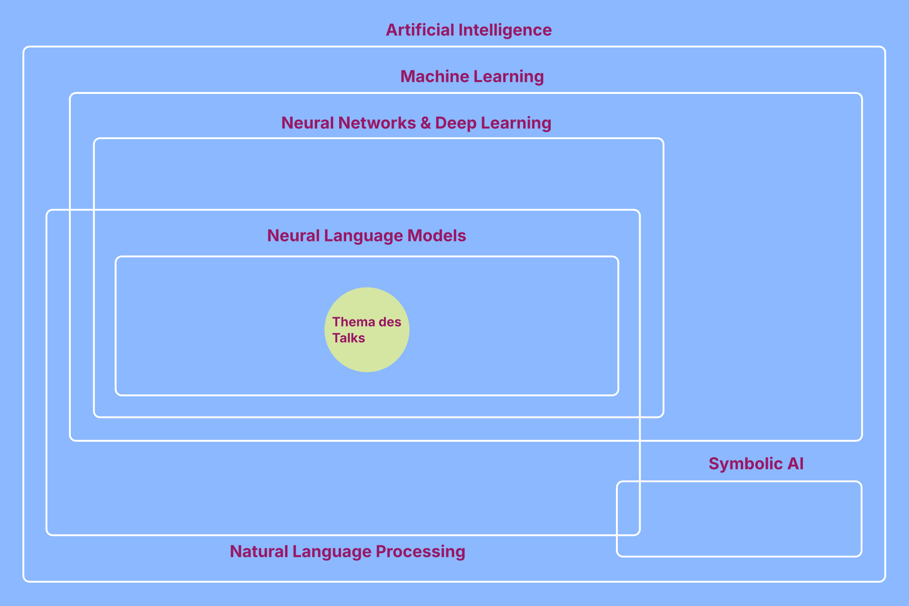

# Intro

## Social Responsibility: Wer sollte uns als Beispiel dienen?

- Peter Thiel erhielt Axel Springer Award: oft als Demokratiepreis bezeichnet 
- Geht an Persönlichkeiten, die „[...] **gesellschaftliche Verantwortung übernehmen**“
  - Andere Personen, die gesellschaftliche Verantwortung übernehmen: Jeff Bezos (2018) · Elon Musk (2020) · Sam Altman (2025)

::: fragment
- Wie man gesellschaftliche Verantwortung übernimmt:

> *„If you're evil, you're at least competent. And if you're evil, you're not bad, and therefore you're actually maybe kind of good because you're at least getting something done.“*
>

:::

[@axelspringer_award; @boeselager2026; @firth2026]{.source}

::: notes
- Konferenz steht unter dem Motto Social Responsibility: guten Beispiele
- Preis, der genau dies auszeichnet, Axel Springer Award. 
- Passt zu Konferenz und zum diesjährigen Theme: gesellschaftliche Verantwortung und "Demokratiepreis"
- Dieses Jahr bekam ihn Thiel, der Aufsichtsratsvorsitzender von Palantir ist: auf Analyse großer Datenmengen spezialisiert; als Kunde viele Militär- und Sicherheitsbehörden; setzt viel KI ein
- Bei der Konferenz sagte er:
- Zitat fasst Big Tech gut zusammen; "move fast and break things" -> Fokus auf "getting something done", aber es ist egal was und welche Konsequenzen es hat 
-> In Wahrheit **das Gegenteil von Verantwortung übernehmen**  
:::

## Getting something done responsibly with ~~artificial~~ superintelligence

- Wie können wir KI in der Zivilgesellschaft verantwortungsvoll nutzen?
- Spannungsfeld: 
  - KI ist durch die Umstände ihrer Herstellung und Verwendung nicht nur ein Werkzeug, sondern (inhärent) politisch und hat externalisierte Kosten
  - Von konkreten Problemen ausgehend kann KI als Werkzeug manchmal die beste Option sein 

[@keymolen2026]{.source}

::: notes
- wie wir versuchen, KI verantwortungsvoll zu nutzen 
- Wir bewegen uns dabei in einem Spannungsfeld:
  - oft am sinnvollsten, KI nur als Werkzeug zu betrachten: für konkrete Problem kann es die beste Option sein
  - aber KI ist nicht *nur* ein Werkzeug: Wer sie herstellt, wie sie genutzt wird und wie sie in die Welt eingebettet ist, wirkt zurück auf die Gesellschaft und auch auf die Zivilgesellschaft
- Wir beschäftigen uns zunächst mit der Einbettung von KI in die Welt
:::

# Wer entwickelt KI?

## Peter Thiel, der Antichrist und der "Grey Tribe"

- Thiel (Palantir) vertritt eine politische Theologie mit dem Antichristen als zentraler Figur
  - verspricht Frieden, Sicherheit und Einheit, z.B. durch **Multilateralismus, internationale Regulierung, interreligiösen Dialog**
  - will aber in Wahrheit Weltherrschaft erlangen und Fortschritt aufhalten

::: fragment
- **Red Tribe** (konservativ) · **Blue Tribe** (progressiv) · **Grey Tribe** (Tech, **Akzelerationismus**)
  - Blue = Regulierung, Institutionen = Thiels „Antichrist“
  - Wie kann man Blue bekämpfen? **Balaji Srinivasan**: Grey sollte sich mit Red gegen Blue verbünden
:::

[@alexander2014; @duran2024; @andreessen2023; @brian2026; @thiel2026]{.source}

::: notes
- Exkurs in die Theologie, Thiel, der ein besonders absurdes Beispiel für Ideologien im Tech-Bereich parat hat
- „getting something done“ als Selbstzweck → relativ ausformulierte Ideologie
- Alles, was „getting something done“ behindert, ist der Antichrist → klare Kandidaten: ...
- Diese Einstellung teilen sich viele mit Big Tech verwobenen Ideologien
- Big-Tech Vordenker wie Balaji Srinivasan teilen US-Gesellschaft in Stämme ein: ...
- Grey Tribe: sog. Akzelerationismus bzw. „effective accelerationism“: technologischen Fortschritt maximal beschleunigen, jede Bremse ist schädlich
- Thiels Antichrist ist das Programm des Blue Tribe
- Balaji Srinivasan schlägt pol. Programm vor: Grey soll sich mit Red verbünden, gegen Blue. In San Francisco schlägt er Zonen vor, in denen Reds willkommen sind und Blues nicht
- Wäre einfach nur kurios und absurd, aber auf d. Grundlage wird investiert und Politik gemacht
- Kommen wir nun vom Antichristen zum Anti-Antichristen
:::

## Nicht das letzte Abendmahl

::: {.img-grid style="display:flex; flex-direction:column; align-items:center; gap:8px;"}
{style="height:270px; margin:0;"}

::: {style="display:flex; justify-content:center; gap:8px;"}
{style="height:265px; margin:0;"}

{style="height:265px; margin:0;"}
:::
:::

[Oben: [@rozen2026] · Unten links: [@trump2026] · Unten rechts: [@leonardo1498]]{.source}

::: notes
- letzte theologische Slide
- Auf Bild: fast den kompletten Grey Tribe (Palantir, Anthropic, OpenAI, Microsoft, Google, Meta, Elon Musk etc.) mit Anführer des Red Tribes, der sich btw. passend zum Thema mal als Jesus dargestellt hat.
- 2024, als Trump wiedergewählt wurde, hat sich Grey/Red-Bündnis verwirklicht: Silicon Valley supported recht geschlossen Trump 
- Bild von Veranstaltung: in Regierungsdokumenten anstatt Artificial Intelligence der Begriff Superintelligence verwenden. 
- In typischer Trump-Selbstentlarvungsmanier -> Marketing-Dimension und nicht-Neutralität der Bezeichnung Künstliche-Intelligenz deutlich [@tnnd2026]
:::

# Entzauberung: Was ist KI eigentlich?

## KI-Begriff: Intelligenz

> Intelligence is the computational part of the ability to achieve goals in the world. [...] Intelligence involves mechanisms, and **AI research has discovered how to make computers carry out some of them and not others**. Such programs should be considered "somewhat intelligent". [@mccarthy_what_2012]

- Intelligenz als auf ein Ziel gerichtete Fähigkeit, die unterschiedliche Komponenten umfasst (z.B. von Logik bis Erkennen von Objekten)

::: notes
- Was ist ein besseres Verständnis von KI als von Superintelligent zu reden? 
- Intelligenz ist kein gesamter künstlicher menschlicher Bewusstsein
- Komponenten, auf Ziel gerichtet
:::

## KI als Oberbegriff

::: notes
- Wenn eine Technologie eine diese Komponenten von Intelligenz abdeckt, ist sie KI
  - Nicht nur generative KI (ChatGPT, Claude)
- Auf diesem Schaubild: KI als Oberbegriff. 
...
- Machine Learning im Titel. Um zu verstehen, wie man dagegen Ragen kann, muss man zunächst verstehen was ML ist
- GPT und Claude sind neuronale Sprachmodelle
:::

# Externalisierte Kosten

::: notes
- Kosten, die nicht der Verursacher, sondern die Allgemeinheit oder die Umwelt trägt
- Kurzfristig außerhalb des Wirtschaftssystem 
:::

## Warum muss KI überhaupt reguliert werden?

- Neuronale Netzwerke 
  - brauchen viele Trainingsdaten und Rechenkapazitäten
  - Output nicht erklärbar

:::: {.columns}

::: {.column width="50%"}
**Ökologisch**

- **Strom & CO₂:** 2030 mehr als ganz Japan
- **Wasser:** 2025 so viel wie alles Flaschenwasser weltweit
:::

::: {.column width="50%"}
**Gesellschaftlich**

- Machtkonzentration
- Diskriminierung
- Ausbeutung (Klickarbeit)
- Cognitive Outsourcing
:::

::::

[@iea2025; @iea2026; @devries2025; @kak2023; @buolamwini2018; @williams2022; @perrigo2023; @jose2025]{.source}

::: notes
- GPT und Claude sind neuronale Sprachmodelle
- Gilt besonders, aber nicht nur für neuronale Netzwerken. Keine vollständige Liste.
- Ökologisch:
  - Strom & CO₂: Laut IEA verbrauchen Rechenzentren bis 2030 mehr als ganz Japan heute.  Ein großer Teil davon kommt weiterhin aus fossilen Quellen.
  - Wasser: KI-Systeme verbrauchten 2025 geschätzt so viel wie der weltweite Flaschenwasserkonsum. v.a. für Kühlung.

- Gesellschaftlich:
  - Wenige Konzerne kontrollieren Rechenleistung, Daten und Modelle und setzen faktisch die Regeln, demokratische Institutionen sind hinterher
  - Machine Learning reproduziert gesellschaftliche Ungleichheiten, Systeme entscheiden dann über Leben von Menschen. 
  - Hinter KI steckt viel menschliche, schlecht bezahlte Arbeit beim Datenlabeling
  - KI kann kognitive Fähigkeiten wie kritisches Denken schwächen. KI unterstützt nicht nur, sondern ersetzt Denkprozesse zunehmend.
- 
:::

## Auswirkungen von KI auf die Zivilgesellschaft

- KI-Zusammenfassungen und Chatbots 
  - Website-Traffic verringert sich drastisch
  - Weniger Kontrolle darüber, wie Informationen Menschen erreichen

::: fragment
- Einfluss auf soziale Beratungsangebote: 
  - Chatbots werden vermehrt als Berater genutzt
  - Ratsuchende von Chatbot-Sessions beeinflusst
  - KI-Psychose sorgt für mehr Krisensituationen
:::

::: fragment
- Ökonomische Zwänge
  - KI steht für Effizienzsteigerung
  - Workslop

- KI-Projekte haben Prestige und bekommen mehr Geld
:::

[@pew2025; @augustin2025; @niederhoffer2025]{.source}

::: notes
- Klicks auf Suchergebnisse in 8 % der Besuche mit KI-Zusammenfassung vs. 15 % ohne; nur 1 % klickt auf eine zitierte Quelle
- 
:::

# KI als Werkzeug wofür? 

## KI-Tasks 

- KI-Methoden werden für Tasks entwickelt und mit für diese zusammengestellten Daten und Metriken evaluiert und verglichen
- Beispiele Tasks: Klassifikation, Textzusammenfassung, Nutzung von Tools
- Einfachste Metrik: Accuracy (Anteil richtiger Klassifikationen)
- Neuronale Netzwerke erzielen beste Performance bei vielen Tasks, bzw. ermöglichen erst manche Tasks [@lecun2015]

::: notes
- schon gesehen, dass man KI  als eine Reihe von auf ein Ziel gerichteter Fähigkeiten verstehen kann, die externalisierte Kosten haben 
  -> vor was sind legitime Ziele, sprechen wir darüber, wie man solche Ziele genauer definieren und wie man Methoden dafür auswählt.
- Von Wissenschaft lernen: Probleme auf einen konkreten Task runterbrechen und sich überlegen, wie man Performance misst
- Hier muss man feststellen..
:::

## "Große" Neuronale Sprachmodelle

- BERT -> Bidirectional encoder representations from transformers (340 Millionen Parameter) [@devlin2019]
    - Finetuning: Anpassung des Modells und Parameter auf Task 
- Claude Mythos oder Fable (generative Modelle) -> Parameterzahl nicht offengelegt; Schätzungen im Bereich mehrerer Billionen
    - In-Context Learning (ICL) und (Few Shot) Prompting -> Keine Veränderung der Parameter [@brown2020]

::: fragment
- „Wie schon der Mythos Aufklärung ist, schlägt Aufklärung in Mythologie zurück“ [@horkheimer_adorno1947]  
:::

::: notes
- Eine Technologie, die zum KI Hype der letzten Jahre geführt hat sind große neuronale Sprachmodelle 
- Groß ist hierbei relativ 340 Millionen zu mehreren Billionen
- Unterschied ältere Sprachmodelle und neue: wie man sie verwenden kann
  - hin zu Universalwerkzeugen
- Empfehlung: Probleme trotzdem auf Tasks runterbrechen 
  - auch große generative Modelle als Werkzeug mit Alternativen zu sehen
  - Performance man nicht als gegeben sehen

- Bezug auf die Benennung: schön, wie sich alles zusammenfügt
  - Zitat aus der Frankfurter Schule, aus "Dialektik der Aufklärung" droppen: ..
  - Mythos als eine Erzählung die Phänomene einordnet ohne richtig zu ergründen ob es der Wahrheit entspricht 
  - Erzählungen rund um KI sind quasi ein Mythos
  - Frankfurter Schule prägt "instrumentelle Vernunft": das führt zurück auf Thiel Zitat von Thiel zu Fokus auf getting smth done als Maßstab -> Mittel anstatt die Ziele des Handelns zu priorisieren ist nämlich instrumentelle Vernunft 
  - 
:::

# KI zwischen Mythos und Fabel(haft)

::: notes
- Wenn man also eine Skala aufmachen will, kann man Mythos, als Begriff negativ verstanden, ans untere Ende setzen und aus satirischen Gründen Fabel(haft) ans andere Ende
- kommen wir zur unseren Erfahrungen von KI-Einsatz in der Zivilgesellschaft und wie man hier versuchen kann, KI vernünftig einzusetzen. 
- Ein Aspekt: Vernunft 
  -> nicht nur Frage danach, ob Mittel dafür geeignet sind, einen Zweck zu erreichen, 
  -> sondern auch mit der Frage beschäftigen, ob der Zweck der richtige ist
:::

## KI als Mythos

- Bessere Informationsarchitektur statt eigener Chatbot  

- Ehrenamtlich Tätige würden KI lieber für Verwaltungstätigkeiten als für Social Media einsetzen [@cdl_ki_ehrenamt]

- Prompt Engineering: "You are a senior air traffic controller, take over routing planes for this airport" [@zheng2024]

- KI als Tech-Fix [@morozov2013]
  - KI wird als Lösung für Probleme vorgeschlagen, aber das eigentliche Problem wird nicht gelöst (Chatbot gegen Einsamkeit)

- Manchmal reicht Prozessoptimierung statt Agentic AI

::: notes 
- Als CDL bieten wir Beratungen an: Chatbot -> oft stellt sich heraus das
- Umfrage durchgeführt. KI wird viel für Content eingesetzt, aber noch wenig für administrative Tätigkeiten, wofür Menschen sie lieber einsetzen würden
- Prompt Engineering als Beispiel für Pseudowissenschaft aus der ein eigenes Business gemacht wird. 
- Tech Fix
- Manchmal kann man Effizienz nicht durch Automatisierung sondern eher durch ...
:::

## KI: Fabel(haft)

- CDL Projekte
  - AWO Demokratieförderquote: Klassifikation von Förderprogrammen mit Fokus auf Recall
  - Schule ein Gesicht geben: Semantische Suche (Informationen mit eigenen Worten finden)
  - genialsozial: Texterkennung bei handschriftlich ausgefüllten Formularen
- AfD-Gutachten: Vorfiltern (Klassifikation) von Äußerungen von AfD-Politiker:innen

[@cdl_demokratiefoerderquote; @verfassungsblog2026]{.source}

::: notes 
- Recall: Fokus true positives, nicht 100% verlassen auf KI bei der Feinarbeit
- Wissenssammlung zu SV: Informationen besser auffindbar machen 
- handwriting recognition als bewusst akzeptierter temporärer tech fix, Untersuchung wie hoch man Performance treiben kann
:::

# How to: Rage against the Machine Learning

- Im Kopf behalten, dass Big Tech aktiv eine fragwürdige politische Agenda verfolgt

- Thiels „Antichrist“ sein: 
  - Regulierung und demokratische Institutionen verteidigen statt „move fast and break things“

- Weniger *„Wie können wir KI einsetzen?“*, mehr *„Welches Problem haben wir (wirklich) und ist KI dafür die beste Lösung?“*
- Mitdenken: *„Wozu – und zu welchem Preis?“*

- Mehr konkrete Handlungsempfehlungen für Zivilgesellschaft: Code of Conduct Demokratische KI (demokratische-ki.de)

::: notes
- Wir sollten alle stolze Antichristen sein, nicht, dass wir Satanisten werden sollten, sondern ...
- „Rage against the Machine Learning“ ist berechtigt, Boykott ist begründbar

- Unserer Meinung sollte das nicht dazu führen, KI prinzipiell abzulehnen (individuelle ethische Entscheidung): man kann sie für konkrete Probleme in Betracht ziehen

- Weiterführend Coc demokratische KI: 
  - konkrete Handlungsempfehlungen für gemeinwohlorientierte Organisationen

:::

# Zeit für Nachfragen und Gedanken

## Quellen {.scrollable}

::: {#refs}
:::
